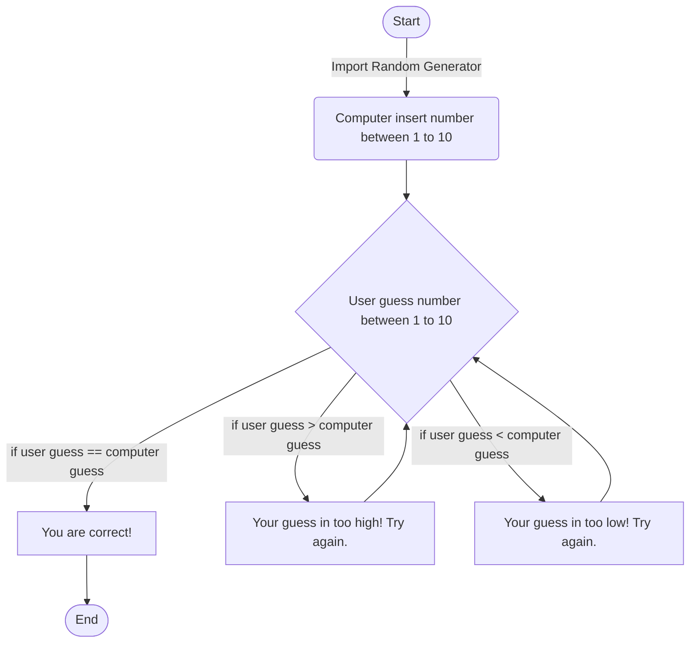

**_Start_** - Starts the program  
**_B_** - Will choose random number between 1 - 10  
**_C_** - Will input user's number between 1 - 10  
**_D_**  - Will output "You are correct!" message and end game  
**_E_**  - Will output "Your guess in too high! Try again" message and loop back to *C* for user to again input a number between 1 - 10.  
**_F_** - Will output "Your guess in too low! Try again" message and loop back to *C* for user to again input a number between 1 - 10.  
**_End_** - Will end the game after the user correctly guessed the computer's number.  
